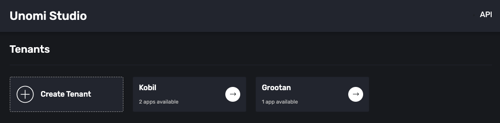
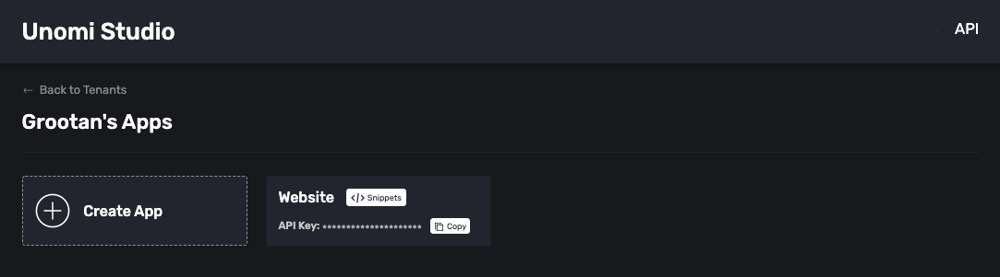
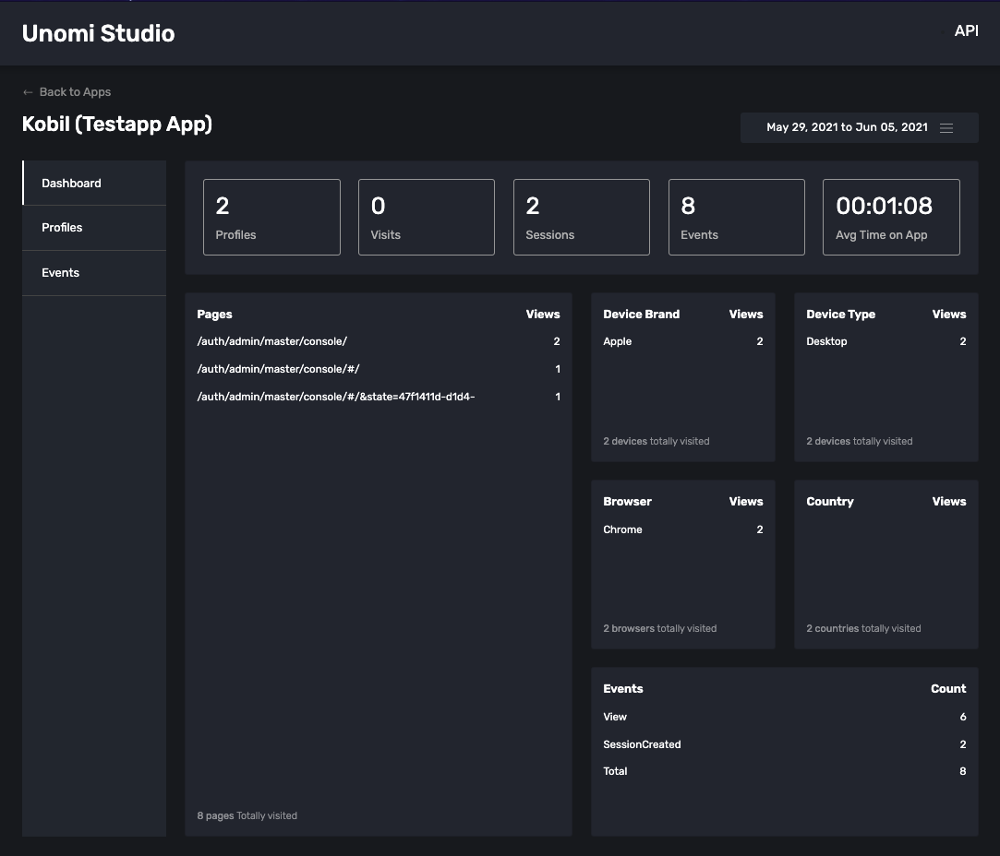

# Unomi Studio
Dashboard to manage apps and tenants for tracking and analytics

## How to run

## Docker
```
docker-compose build
```

```
docker-compose up -d
```

Wait till unomi docker container is up and running

```
cd scripts
./post-deploy-script.sh
```

## Dev mode

Remove unomi-node from docker-compose and repeat above steps

Set following environment variables.

```
export UNOMI_HOST=http://localhost:8181
export UNOMI_USERNAME=karaf
export UNOMI_PASSWORD=karaf
export ELASTIC_HOST=http://localhost:9200
```
Go into api folder and run following commands

```
npm install
```

```
nodemon index.js
```
or 
```
node index.js
```

## UI

Run following url in browser

```
http://localhost:8085
```

### Tenant View



### Apps View



### Dashboard View



## Rest Api

Unomi studio exposes api and ui


```
Base Path: http://localhost:8085/v1/api
```

# Documentation

Read the [docs](https://unomi-studio.netlify.app)

# Issues

For issues please report [here](https://github.com/grootan/unomi-studio/issues)

# Roadmap

-> Addition and deletion of Rules
-> Add Support for goals
-> Add Support for campaigns